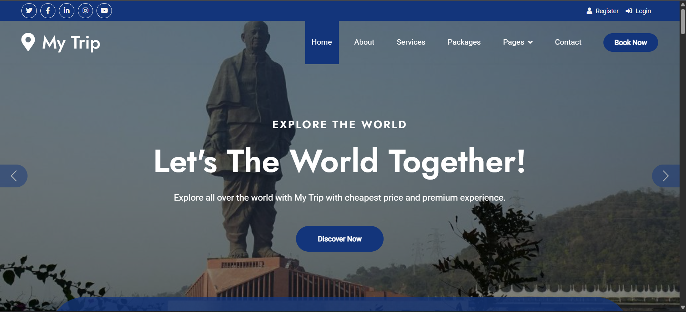
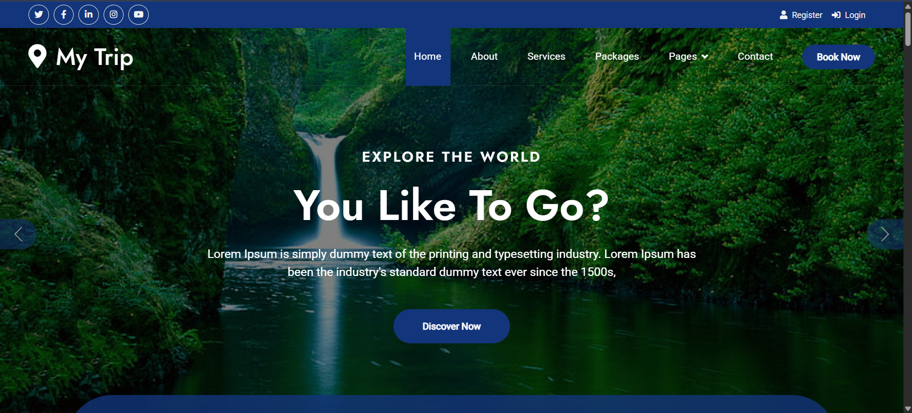
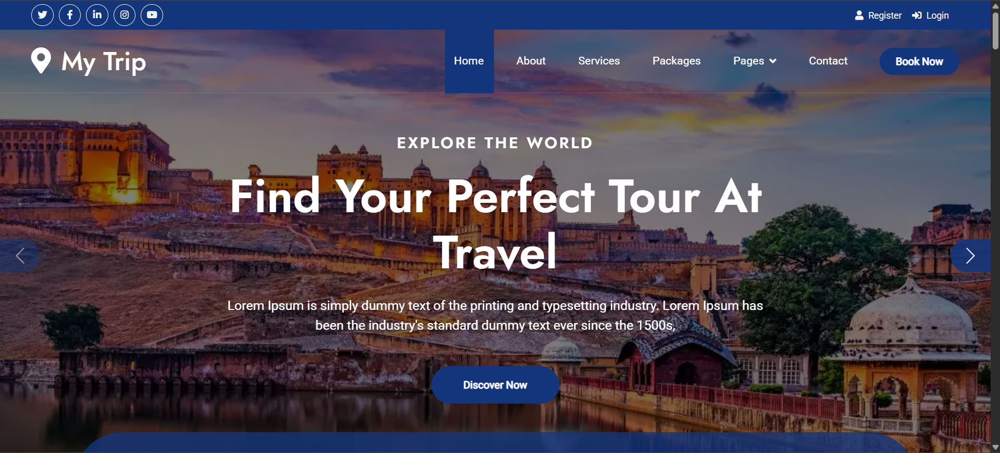
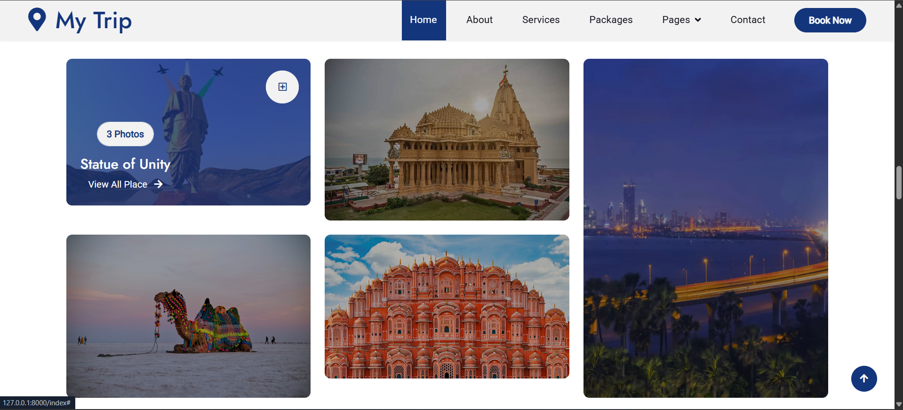
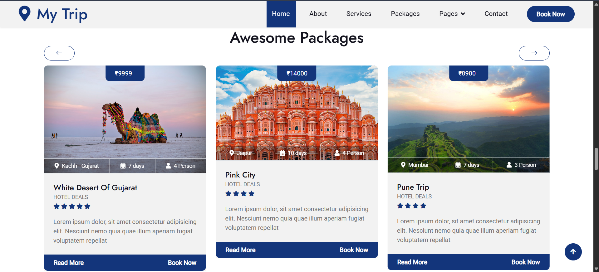
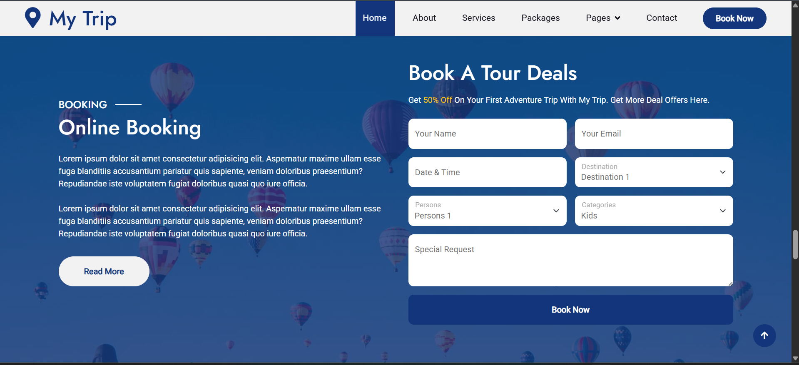
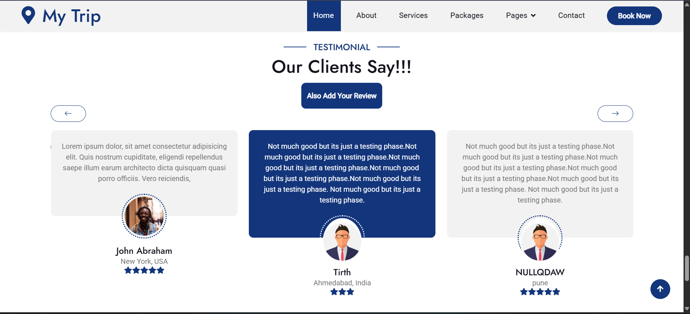
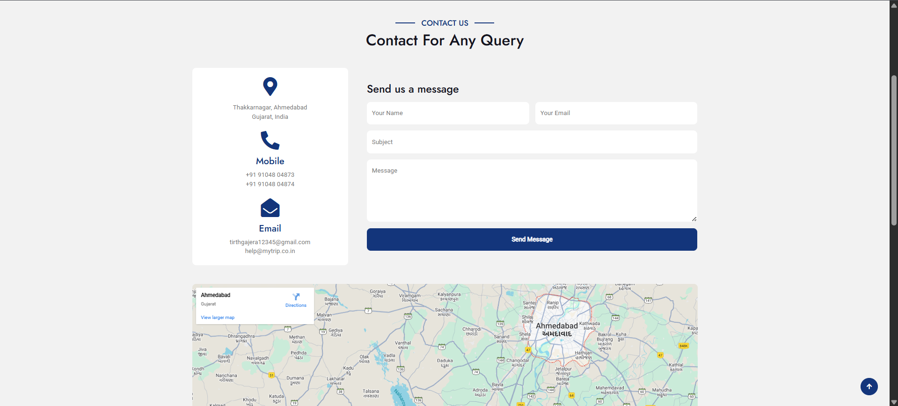

# 🌍 My Trip - Travel UI Experience

## ✨ Overview

**My Trip** is a front-end-heavy travel planning website built with 💻 **HTML**, 🎨 **CSS**, 🧠 **JavaScript**, and ⚙️ **Django** for backend structure. It was created as part of a **friendly UI design challenge** to showcase design flair, responsiveness, and user interactivity.

Even though the backend logic is minimal, the project features an **aesthetically rich UI** that provides a **real-world simulation** of a travel planning site.

---

## 🔍 Features

- 🎯 **Insane UI** focused on design, layout, and modern aesthetics
- 🧭 **Destination Browsing** – Tourists can explore places visually
- 💵 **Price Estimates** – Shows potential trip costs for each destination
- 💬 **Review System** – Users can read reviews (dummy UI for now)
- 🛒 **Payment Option UI** – (Interface available, functionality not implemented)
- 📱 **Fully responsive** and mobile-friendly layout

---

## 🌐 Tech Stack

- **Frontend**: HTML, CSS, JavaScript
- **Backend (Structure Only)**: Django
- **Design Focus**: UI/UX-heavy static travel planner

---

## 🛠️ Use Case

This project is ideal as a:
- 🧪 **UI Showcase** for frontend portfolios
- 🧳 **Static Website** for destination previews
- 📈 **Design template** for future travel-based applications
- 🔥 Starting point for adding full backend functionality

---

## 💡 Future Enhancements

- Add **real-time backend functionality**
- Integrate **payment gateway (Razorpay/Stripe)**
- Allow **user authentication and bookings**
- Implement **Google Maps & reviews API**
- Connect to **MongoDB/PostgreSQL** for persistent review storage

---

## 📸 Screenshots

---

## 🧑‍💻 Made By

**💙 Tirth Gajera**, as part of a creative UI challenge 🖌️  
Focused on clean code, design-first thinking, and user-centric layout.

---

## ⭐ Why This Project?

> Designed with the goal to simulate a real-world trip planner, *My Trip* focuses on **visually engaging interfaces** and **clean user experience**, proving that great design can stand strong even before the logic kicks in.

---
